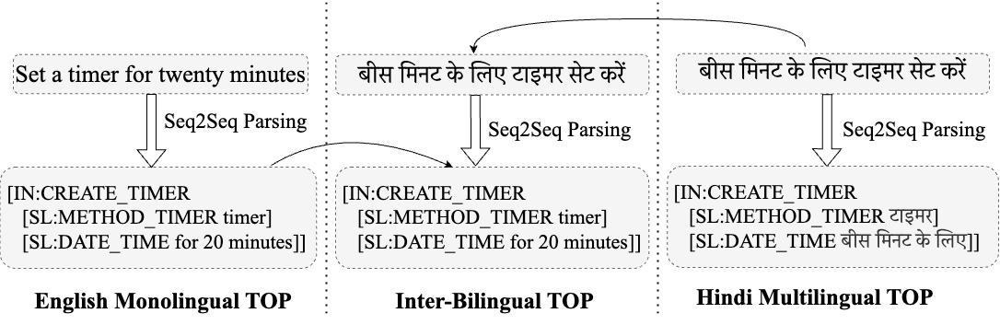
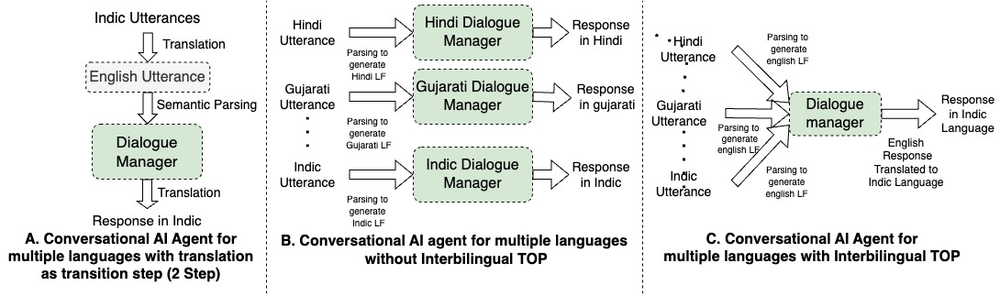

# Indic-SemParse

Implementation of the translation pipeline, automatic sampling and scoring,human evaluation and experiments of our NLP4ConvAI@ACL2023 paper: [IE-SemParse: Evaluating Interbilingual Semantic Parsing for Indian Languages](https://arxiv.org/abs/2304.13005). To explore the dataset online visit [dataset page](https://huggingface.co/datasets/Divyanshu/IE_SemParse).


Below are the details about the [IE_SemParse datasets]([#todo](https://huggingface.co/datasets/Divyanshu/IE_SemParse)) and scripts for reproducing the results reported in the NLP4ConvAI@ACL2023 Paper.

## Task Description



In this paper we proposed a novel task for Inter-Bilingual semantic parsing task where the utterance is in indic language and the model is required to generate logical form with english slot values. 

## Task Motivation


1. Approach A: Translate to English then parse to logical form.
2. Approach B: Separate parser and dialogue manager for each language
3. Approach C: Inter-bilingual Semantic Parsing.

Inter-bilingual Semantic Parsing is a good middle ground approach to enhance model’s multilingual semantic parsing ability and reduce system latency and redundancy.


## Translation pipeline

The code is present in the `translation_notebooks` folder containing 2 notebooks, namely `dataset_translation.ipynb` and `post_processing.ipynb`. 


The Dataset IE-mTOP, IE-multilingualTOP and IE-multiATIS++ are present i huggingface datasets [dataset page](https://huggingface.co/datasets/Divyanshu/IE_SemParse).

## Experiments
We Experiment with 4 approached of train test strategies better described in the paper. 

1. Indic train: [file](./src/indic_train.py)
2. Translate Test: [file](./src/translate_test.py)
3. English+Indic Train: [file](./src/english_indic_train.py)
4. Train All: [file](./src/train_all.py)


To run all experiments in your setup just run the following

```
bash setup.
bash run_tests.sh
```

## Results and Analysis

All the analysis notebooks are in `analysis_notebooks` folder.

## LICENSE
All the datasets created as part of this work will be released under a CC-0 license and all models & code will be release under an MIT license

## Citation

```
@misc{aggarwal2023evaluating,
      title={Evaluating Inter-Bilingual Semantic Parsing for Indian Languages}, 
      author={Divyanshu Aggarwal and Vivek Gupta and Anoop Kunchukuttan},
      year={2023},
      eprint={2304.13005},
      archivePrefix={arXiv},
      primaryClass={cs.CL}
}
```
